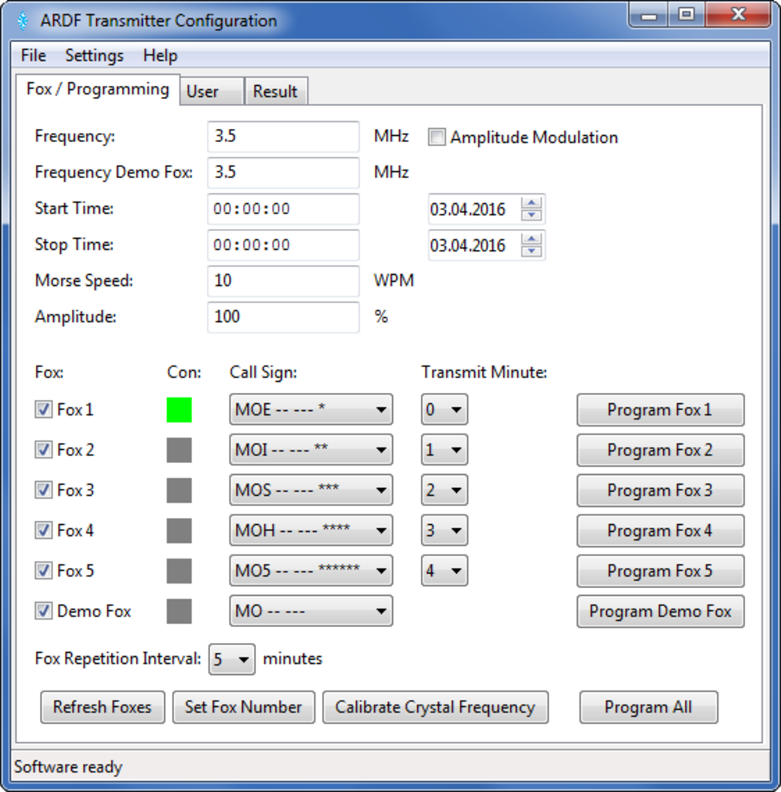
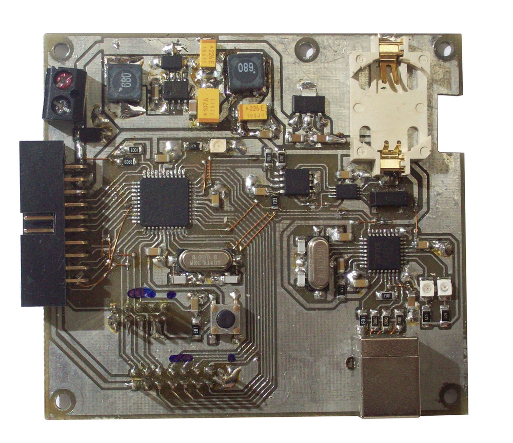
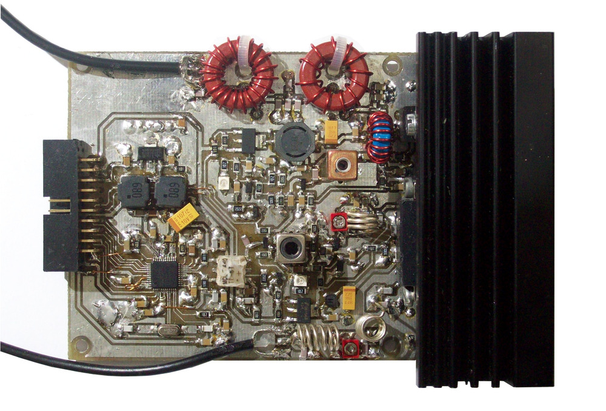
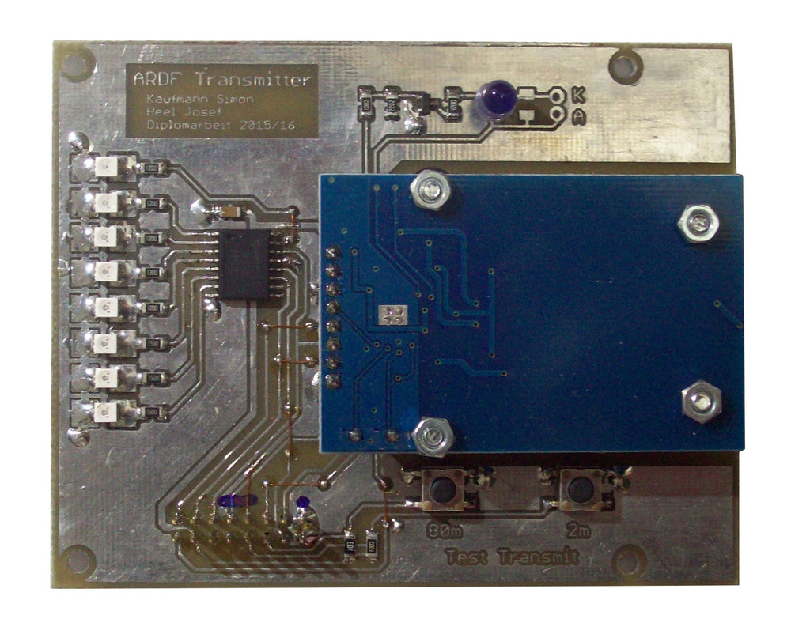
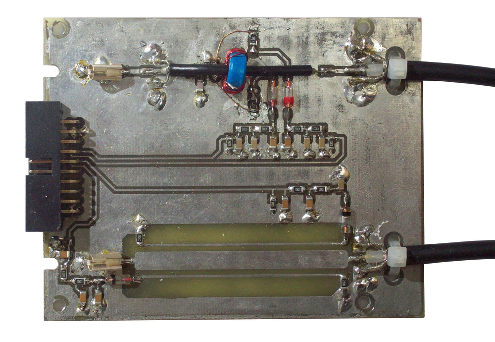

# ARDF-Transmitter
Firmware for Amateur Radio Direction Finding Transmitter built as final year project at Secondary College

## Pictures

### PC Configuration Software:

### Printed Curcuit Boards:
Microcontroller board:

DDS board:

RFID board:

Directional coupler board:

## Further information for this project

Look at http://ardf.heka.or.at (in German)
